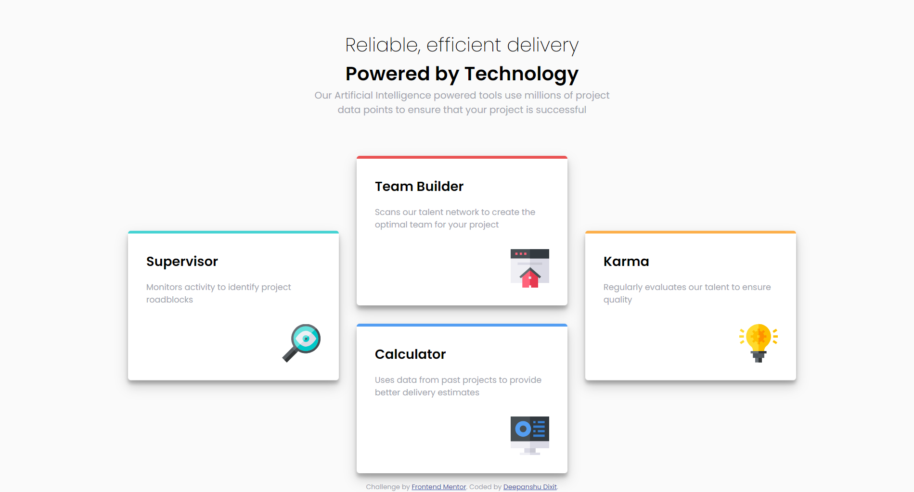
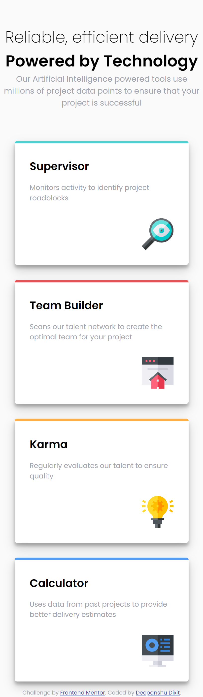

# Table of Contents

- [Overview](#overview)
  - [The challenge](#the-challenge)
  - [Screenshot](#screenshot)
  - [Links](#links)
- [My process](#my-process)
  - [Built with](#built-with)
  - [What I learned](#what-i-learned)
  - [Continued development](#continued-development)
  - [Useful resources](#useful-resources)
- [Author](#author)
- [Acknowledgments](#acknowledgments)

## Overview

### The challenge

The challenge was to build a responsive four-card feature section. Each card needed to have a title, description, and an icon. The cards should be visually appealing and maintain a consistent design across different screen sizes. The layout should be flexible and adapt seamlessly from desktop to mobile devices.

### Screenshot

### Links

- Solution URL: [GitHub Repository](https://github.com/Deepanshu1337/flexbox-four-card-feature-section-master)
- Live Site URL: [Live Demo](https://four-card-challange.surge.sh)

## My process

### Built with

- **Semantic HTML5**: Ensuring the use of semantic elements for better structure and accessibility.
- **CSS3**: Using custom properties, Flexbox, and media queries for responsive design.
- **Google Fonts**: Enhancing the typography with the 'Poppins' font.

### What I learned

1. **Responsive Design with Flexbox**: I utilized Flexbox to create a responsive layout that adjusts seamlessly across different screen sizes. This involved understanding how to use `flex-wrap`, `justify-content`, and `align-items` to control the layout.
   
2. **HTML Structure and Semantics**: I improved my HTML structure by using semantic elements such as `<header>`, `<main>`, and `<footer>`. This made the code more readable and accessible.

3. **Consistent Design with CSS**: By using CSS custom properties and consistent styles, I ensured that each card maintained a cohesive look. The use of CSS custom properties also made it easier to manage and update styles.

4. **Typography with Google Fonts**: I explored using Google Fonts to enhance the visual appeal of the text. The 'Poppins' font added a modern and clean look to the design.

### Continued development

For future projects, I plan to:

- **Explore CSS Grid**: To handle more complex layouts that require precise control over the positioning of elements.
- **Add Interactivity with JavaScript**: Implementing JavaScript to add interactivity and dynamic features, such as animations and hover effects.
- **Improve Accessibility**: Focusing on making the web pages more accessible by incorporating ARIA roles and ensuring all interactive elements are keyboard accessible.

### Useful resources

- [Frontend Mentor](https://www.frontendmentor.io) - A great platform for coding challenges and practice.
- [Google Fonts](https://fonts.google.com/) - Used for importing the 'Poppins' font family.
- [MDN Web Docs](https://developer.mozilla.org/) - An excellent resource for web development documentation and tutorials.

## Author

- LinkedIn - [Deepanshu Dixit](https://www.linkedin.com/in/deepanshudixit280/)
- GitHub - [Deepanshu1337](https://github.com/Deepanshu1337)

## Acknowledgments

I would like to thank [Frontend Mentor](https://www.frontendmentor.io) for providing this challenge and the community for their valuable feedback and support.
